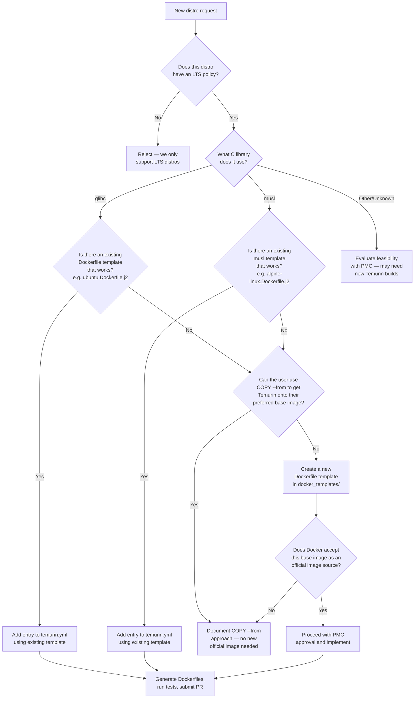

# Distribution Maintenance for Eclipse Temurin Container Images

## 1. Introduction

This document describes the policy, criteria, and practical steps for adding, maintaining, deprecating, and removing operating system distributions in the Eclipse Temurin container images. It is intended for maintainers of the [containers](https://github.com/adoptium/containers) repository.

## 2. Currently Supported Distributions

The current list of supported distributions can be seen at [Supported Platforms](https://adoptium.net/supported-platforms/). The Docker icon indicates which distributions are supported as part of the official image manifest.

All supported distros and their configuration are defined in [`config/temurin.yml`](config/temurin.yml). At the time of writing, we support:

| OS Family | Distributions |
|-----------|--------------|
| Ubuntu | Resolute (26.04), Noble (24.04), Jammy (22.04) |
| UBI (Red Hat) | UBI 10 Minimal, UBI 9 Minimal |
| Alpine Linux | 3.23, 3.22, 3.21 |
| Windows | Server Core LTSC 2022/2025, Nano Server LTSC 2022/2025 |

### Support Commitments

We pledge to support the following:

- **Ubuntu**: All actively supported LTS versions. Ubuntu LTS releases receive five years of standard support from Canonical, and we aim to carry every version that is still within that window.
- **Alpine Linux**: All actively supported versions. Alpine has a roughly two-year support cycle per release; we track every version that is still receiving security updates.
- **Red Hat UBI**: All actively supported UBI Minimal versions that are still receiving security updates from Red Hat.
- **Windows**: All actively supported Windows Server LTSC releases, in both Server Core and Nano Server variants.

We **may remove a distribution mid-Java-LTS-release** if it reaches End-of-Life upstream and no longer receives security updates. Continuing to ship images on an unsupported base OS is a security risk we are not willing to carry.

We **may deprecate older distributions for future Java versions** rather than removing them outright. For example, older Alpine versions may be marked `deprecated` so that they stop receiving Dockerfiles for the next Java release (e.g. JDK 27) while still being maintained for earlier Java LTS versions. This is controlled via the `deprecated` field in `temurin.yml` (see [Section 6](#6-deprecating-a-distribution)).

## 3. Criteria for Adding New Distributions

All proposals for new distributions must be reviewed and approved by the Project Management Committee (PMC). The PMC evaluates each proposal based on the following criteria.

### 3.1 Long-Term Support (LTS) Requirement

Only distributions with a commitment to long-term support are considered to ensure stability and ongoing support.

### 3.2 Community Demand

The distribution must demonstrate significant demand from the Adoptium community or enterprise users. Strong consideration will be given to proposals received from [Adoptium Working Group Members](https://adoptium.net/members/).

### 3.3 Technical Feasibility

The distribution should be capable of supporting the Eclipse Temurin versions without requiring excessive adaptations.

### 3.4 Compatibility Testing

The Adoptium project must have access to sufficient testing resources matching the proposed distribution. New distributions must pass a predefined set of compatibility tests to confirm that existing functionalities are not adversely affected.

### 3.5 Official Base Images

Because Eclipse Temurin images are published as [official images](https://docs.docker.com/trusted-content/official-images/) in collaboration with Docker, there are restrictions as to which base images can be supported.

### 3.6 Encouraging Flexible Deployment via Docker

While we strive to support a range of widely-used distributions, our main goal is not to support every possible distribution. Instead, we encourage users to leverage Docker's `COPY` command to deploy Java and other dependencies on top of any base image they prefer:

```dockerfile
FROM your-choice-of-base-image

COPY --from=eclipse-temurin:21-jdk /opt/java/openjdk /opt/java/openjdk

ENV JAVA_HOME=/opt/java/openjdk
ENV PATH="${JAVA_HOME}/bin:${PATH}"
```

## 4. How Distribution Configuration Works

### 4.1 Configuration File

All distributions are defined in [`config/temurin.yml`](config/temurin.yml). The file is organised by OS family (`linux`, `alpine-linux`, `windows`) with a list of configurations under each. Example entry:

```yaml
configurations:
  linux:
  - directory: ubuntu/noble
    image: ubuntu:24.04
    architectures: [aarch64, arm, ppc64le, riscv64, s390x, x64]
    os: ubuntu
```

Each configuration entry has the following fields:

| Field | Required | Description |
|-------|----------|-------------|
| `directory` | Yes | Path under the version directory (e.g. `ubuntu/noble`). This becomes part of the Dockerfile output path: `<version>/<jdk\|jre>/<directory>/Dockerfile`. |
| `image` | Yes | The Docker base image to use (e.g. `ubuntu:24.04`, `alpine:3.23`). |
| `architectures` | Yes | List of CPU architectures to build for. Valid values: `aarch64`, `arm`, `ppc64le`, `riscv64`, `s390x`, `x64`. |
| `os` | Yes | The Dockerfile template to use. Must match one of the Jinja2 templates in `docker_templates/`: `ubuntu`, `alpine-linux`, `ubi-minimal`, `servercore`, or `nanoserver`. |
| `deprecated` | No | Java major version number at which to stop generating Dockerfiles for this distro. For example, `deprecated: 25` means the distro will not receive Dockerfiles for Java 25 or later. |
| `versions` | No | Override the list of Java versions to generate for this distro. Defaults to all supported versions from the Adoptium API. |

### 4.2 Dockerfile Generation

[`generate_dockerfiles.py`](generate_dockerfiles.py) reads `config/temurin.yml`, queries the [Adoptium API](https://api.adoptium.net) for the latest release information, and renders Dockerfiles using the Jinja2 templates in [`docker_templates/`](docker_templates/).

The generated Dockerfiles are written to:

```
<java-version>/<jdk|jre>/<directory>/Dockerfile
```

For example: `21/jdk/ubuntu/noble/Dockerfile`.

### 4.3 Dockerfile Templates

Each OS family has a corresponding Jinja2 template:

| Template | Used for |
|----------|----------|
| `ubuntu.Dockerfile.j2` | Ubuntu-based images |
| `alpine-linux.Dockerfile.j2` | Alpine Linux images |
| `ubi-minimal.Dockerfile.j2` | Red Hat UBI Minimal images |
| `servercore.Dockerfile.j2` | Windows Server Core images |
| `nanoserver.Dockerfile.j2` | Windows Nano Server images |

Shared logic (architecture selection, version checks, entrypoints, etc.) lives in `docker_templates/partials/`.

### 4.4 Docker Hub Manifest

[`dockerhub_doc_config_update.py`](dockerhub_doc_config_update.py) reads the same `config/temurin.yml` and the generated Dockerfiles to produce the official Docker Hub manifest file (`eclipse-temurin`). This manifest is submitted as a PR to the [docker-library/official-images](https://github.com/docker-library/official-images) repository.

### 4.5 Ordering Matters

The **first entry** in each OS family list in `temurin.yml` is treated as the default image for that family. This affects tag generation — the default linux image gets `SharedTags` (tags without a distro suffix, e.g. `21-jdk`) in the Docker Hub manifest. When adding a new distro, add it at the correct position: the newest/preferred distro should be first.

### 4.6 Automation

A [GitHub Action](.github/workflows/updater.yml) runs every 30 minutes. It executes `generate_dockerfiles.py --force`, and if any Dockerfiles change, it opens a PR automatically. This means that once a distro is added to `temurin.yml`, Dockerfiles will be generated on the next automated run.

## 5. Adding a New Distribution

### Decision Flowchart

Use this flowchart to evaluate whether and how to add a new distribution:



### 5.1 Get PMC Approval

Submit a proposal (see [Section 3](#3-criteria-for-adding-new-distributions)) and obtain PMC approval before making any code changes.

### 5.2 Add the Configuration Entry

Edit [`config/temurin.yml`](config/temurin.yml) and add a new entry under the appropriate OS family. Include:

- The `directory` name (typically `<os>/<codename>` e.g. `ubuntu/noble`)
- The base `image` (e.g. `ubuntu:24.04`)
- The supported `architectures` — check which architectures Temurin builds for on the target OS via the [Adoptium API](https://api.adoptium.net/v3/info/available_releases)
- The `os` template name

Place the entry at the correct position. Entries are ordered with the newest/preferred distro first (this determines which distro gets the default shared tags).

**Example — adding Ubuntu 28.04 (Xenial Xerus):**

```yaml
  linux:
  # EOL April 2033
  - directory: ubuntu/xenial-xerus
    image: ubuntu:28.04
    architectures: [aarch64, arm, ppc64le, riscv64, s390x, x64]
    os: ubuntu
```

### 5.3 Add a Dockerfile Template (if needed)

If the new distro uses an existing OS family (e.g. a new Ubuntu version), no template changes are needed — it will use the existing `ubuntu.Dockerfile.j2`.

If adding a completely new OS type, create a new `<os>.Dockerfile.j2` template in `docker_templates/` and update `generate_dockerfiles.py` if the OS family name needs any special handling (e.g. architecture mappings in `archHelper()`).

### 5.4 Generate and Verify Dockerfiles

Run the generator locally to verify:

```bash
pip3 install -r requirements.txt
python3 generate_dockerfiles.py --force
```

Check that Dockerfiles are generated in the expected directories and look correct.

### 5.5 Run Sanity Checks

```bash
./sanity.sh
```

This verifies there are no empty checksums or download URLs in the generated Dockerfiles.

### 5.6 Run Tests

```bash
python3 -m pytest test_generate_dockerfiles.py test_dockerhub_doc_config_update.py
```

### 5.7 Submit a PR

Submit a PR with:
1. The `temurin.yml` change
2. The generated Dockerfiles (from running `generate_dockerfiles.py --force`)

The CI pipeline will build and test all generated Docker images.

### 5.8 Update the Docker Hub Manifest

After the PR is merged:

```bash
git fetch --all && git checkout main && git pull
python3 dockerhub_doc_config_update.py
```

Submit the generated `eclipse-temurin` manifest file as a PR to [docker-library/official-images](https://github.com/docker-library/official-images/blob/master/library/eclipse-temurin).

## 6. Deprecating a Distribution

When a distribution is approaching End-of-Life (upstream EOL), we deprecate it so that newer Java versions are no longer built for it, while older Java versions continue to be available.

### 6.1 When to Deprecate

- When the upstream distribution announces an EOL date
- When the PMC determines a distribution should be phased out
- When we want to stop generating images for a distro on future Java versions while continuing to support it for existing ones (e.g. dropping Alpine 3.21 for JDK 27 onwards)
- Aim to announce deprecation through official channels at least six months before full removal

### 6.2 How to Deprecate

Add a `deprecated` field to the distribution's entry in `temurin.yml`. The value is the Java major version at which to stop generating Dockerfiles.

**Example — deprecating UBI 9 Minimal starting from Java 25:**

```yaml
  - directory: ubi/ubi9-minimal
    architectures: [aarch64, ppc64le, s390x, x64]
    image: redhat/ubi9-minimal
    deprecated: 25
    os: ubi-minimal
```

This means:
- Java 8, 11, 17, 21, and any version < 25 will continue to receive Dockerfile updates for UBI 9 Minimal
- Java 25 and later will **not** generate Dockerfiles for UBI 9 Minimal

After adding the `deprecated` field, re-run `generate_dockerfiles.py --force` to remove any Dockerfiles that should no longer exist, and update the Docker Hub manifest.

## 7. Removing a Distribution

A distribution may be fully removed in two scenarios:

1. **Scheduled removal**: The distro was previously deprecated and all associated Java versions have moved past the deprecation threshold.
2. **Immediate removal**: The distro has reached EOL upstream and no longer receives security updates. In this case we may remove it mid-Java-LTS-release to avoid shipping images on an insecure base. The PMC will approve this action.

To remove a distribution:

1. Remove the entry from `temurin.yml`
2. Run `python3 generate_dockerfiles.py --force` to clean up generated Dockerfiles
3. Update the Docker Hub manifest
4. Submit PRs for both this repository and the docker-library/official-images repository

Previous tagged versions remain available on Docker Hub for historical access and audit purposes but are not recommended for production use.

## 8. Updating an Existing Distribution Version

When a distribution releases a new minor/patch version (e.g. Alpine 3.22 → 3.23):

1. Add the new version as a new entry in `temurin.yml` (placed first in the list if it should become the new default)
2. Optionally add a `deprecated` field to the older version to phase it out for newer Java releases
3. Follow the standard generation and PR workflow from [Section 5.4](#54-generate-and-verify-dockerfiles) onwards

## 9. Architecture Support

Not all architectures are available for all distributions. When adding a new distro, verify:

1. The base image supports the target architectures
2. Temurin binaries exist for those architectures on the target OS (check the [Adoptium API](https://api.adoptium.net))
3. The architecture name maps correctly — see `archHelper()` in `generate_dockerfiles.py` and `DOCKERFILE_ARCH_MAP` in `dockerhub_doc_config_update.py`

Current architecture identifiers used in `temurin.yml`:

| Config value | Ubuntu/Debian | Alpine | Docker Hub |
|-------------|---------------|--------|------------|
| `x64` | `amd64` | `x86_64` | `amd64` |
| `aarch64` | `arm64` | `aarch64` | `arm64v8` |
| `arm` | `armhf` | — | `arm32v7` |
| `ppc64le` | `ppc64el` | — | `ppc64le` |
| `s390x` | `s390x` | — | `s390x` |
| `riscv64` | `riscv64` | — | `riscv64` |

## 10. Quick Reference

| Task | What to change |
|------|---------------|
| Add a new distro | Add entry to `temurin.yml`, generate Dockerfiles, update manifest |
| Deprecate a distro for new Java versions | Add `deprecated: <version>` to entry in `temurin.yml` |
| Fully remove a distro | Remove entry from `temurin.yml`, run generator with `--force` |
| Change default distro for an OS family | Move the preferred entry to the first position in the list |
| Add architecture support | Add arch to the `architectures` list in the distro's entry |

## 11. Amendment Procedure

The process for updating this document includes community consultation and must be approved by a majority of the Project Management Committee (PMC).

## Feedback and Improvements

Feedback on this document is welcome and can be submitted via [GitHub issues](https://github.com/adoptium/containers/issues/new/choose).
